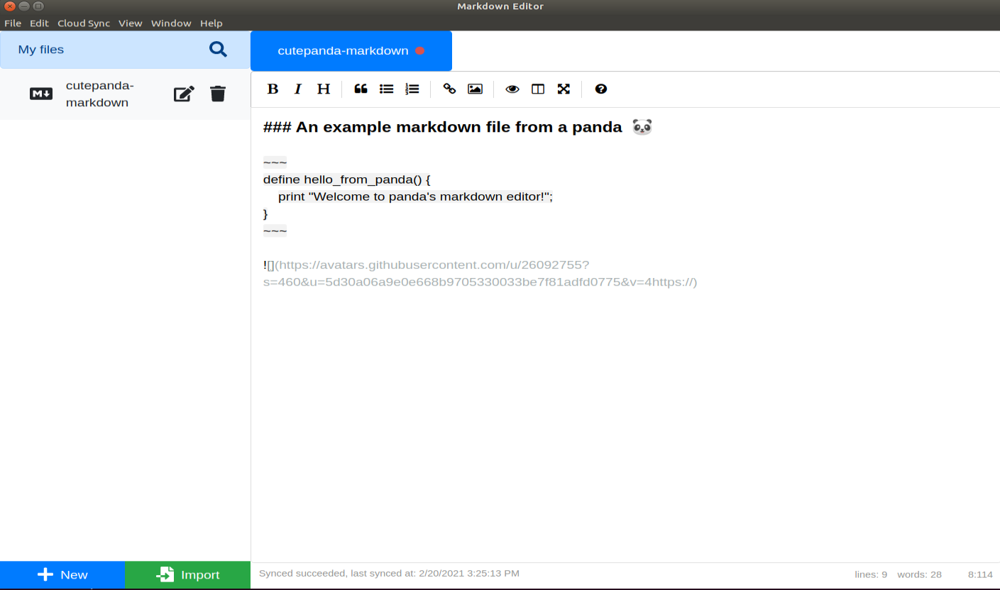
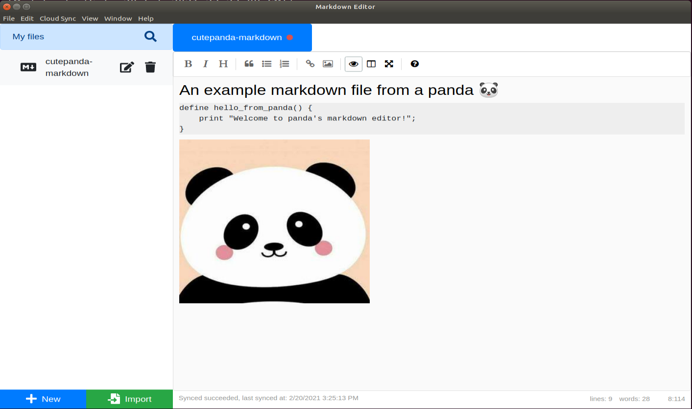
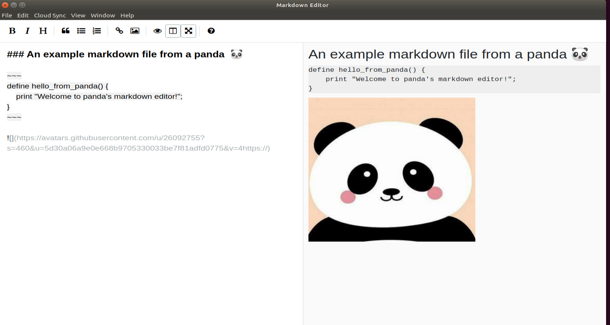
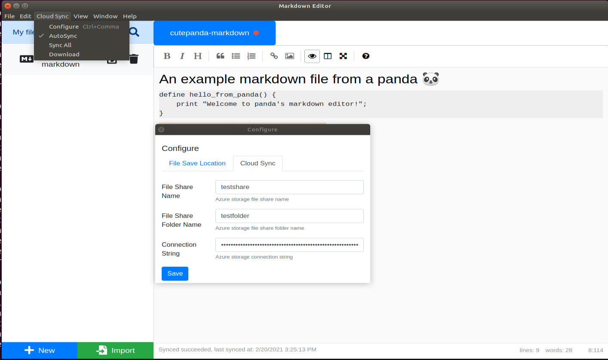

[![Contributors][contributors-shield]][contributors-url]
[![Forks][forks-shield]][forks-url]
[![Stargazers][stars-shield]][stars-url]
[![Issues][issues-shield]][issues-url]
[![MIT License][license-shield]][license-url]


<br/>
<p align="center">
  <h1 align="center">Markdown editor with cloud storage auto-synchronization</h1>
</p>


<details open="open">
  <summary>Table of Contents</summary>
  <ol>
    <li>
      <a href="#about-the-project">About The Project</a>
      <ul>
      <li><a href="#features">Features</a></li>
        <li><a href="#built-with">Built With</a></li>
      </ul>
    </li>
    <li>
      <a href="#development">Development</a>
    </li>
    <li><a href="#highlighted-features">Usage</a></li>
    <li><a href="#license">License</a></li>
    <li><a href="#contact">Contact</a></li>
  </ol>
</details>


<br />

## About The Project

A simple, beautiful, and cross-platform Markdown editor with cloud storage synchronization.
<br/>

<br/>

### Features
- Cross-platform support: Edit a Markdown on different OS: Mac, Windows, and Linux
- Basic features: Read and edit standard Markdown files
- Other useful editor features: File search, side-by-side preview, image insert, code blocks, list insert, text bold, italic, quote...
- Cloud auto-sync: Automatically upload files to cloud storage. Azure is only supported for now, AWS and Dropbox supports are in-progress.
- Auto-upgrade: Automatic user notification for version upgrade.

<br/>

### Built With

* [Electron](https://www.electronjs.org/)
* [React](https://reactjs.org/)
* [SimpleMDE](https://github.com/sparksuite/simplemde-markdown-editor)
* [Microsoft Azure Storage](https://azure.microsoft.com/en-us/services/storage/)

<br/>


## Development 
 
* install [npm](https://docs.npmjs.com/downloading-and-installing-node-js-and-npm)

* install [git](https://git-scm.com/book/en/v2/Getting-Started-Installing-Git)
  
* How to build and debug:
  ```sh
  npm install: setup all the dependencies
  npm run dev: run and test locally
  npm run dist: build a binary locally
  ```
* How to release:
  ```sh
  npm run release: build and release binary distributions to Github (please replace the GH_TOKEN with your Github personal access token in package.json).
  ```
<br />


## Highlighted features

* Real-time Preview
  <br/>
  
* Side-by-side Preview
  <br/>
  
* Cloud Auto-sync
  <br/>
  
  <br />

## License

Distributed under the MIT License. See `LICENSE` for more information.

<br/>

## Contact
Project Link: [https://github.com/cutePanda123/cloud-markdown-editor](https://github.com/cutePanda123/cloud-markdown-editor)


<!-- MARKDOWN LINKS & IMAGES -->
<!-- https://www.markdownguide.org/basic-syntax/#reference-style-links -->
[contributors-shield]: https://img.shields.io/github/contributors/cutePanda123/cloud-markdown-editor.svg?style=for-the-badge
[contributors-url]: https://github.com/cutePanda123/cloud-markdown-editor/graphs/contributors
[forks-shield]: https://img.shields.io/github/forks/cutePanda123/cloud-markdown-editor.svg?style=for-the-badge
[forks-url]: https://github.com/cutePanda123/cloud-markdown-editor/network/members
[stars-shield]: https://img.shields.io/github/stars/cutePanda123/cloud-markdown-editor.svg?style=for-the-badge
[stars-url]: https://github.com/cutePanda123/cloud-markdown-editor/stargazers
[issues-shield]: https://img.shields.io/github/issues/cutePanda123/cloud-markdown-editor.svg?style=for-the-badge
[issues-url]: https://github.com/cutePanda123/cloud-markdown-editor/issues
[license-shield]: https://img.shields.io/github/license/cutePanda123/cloud-markdown-editor.svg?style=for-the-badge
[license-url]: https://github.com/cutePanda123/cloud-markdown-editor/blob/master/LICENSE.txt